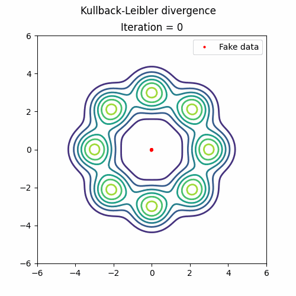
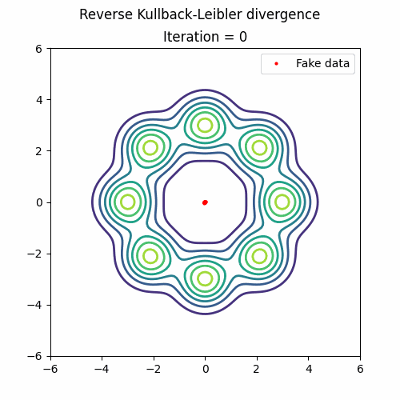
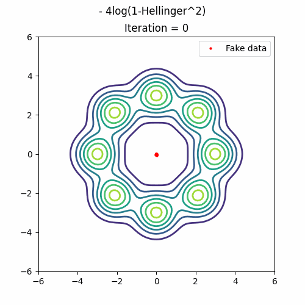
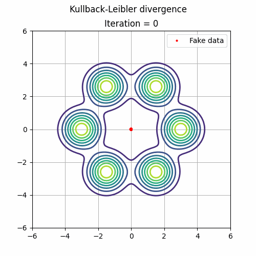
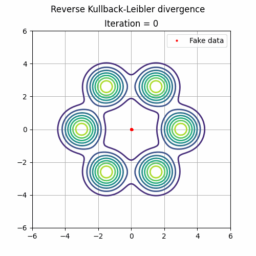
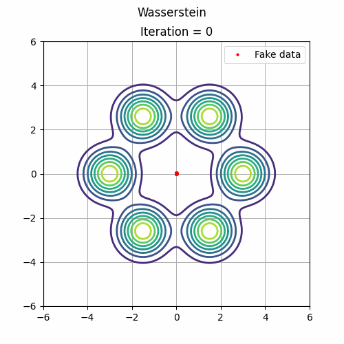
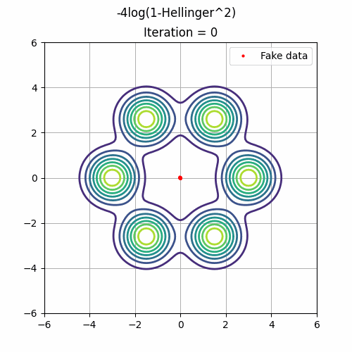
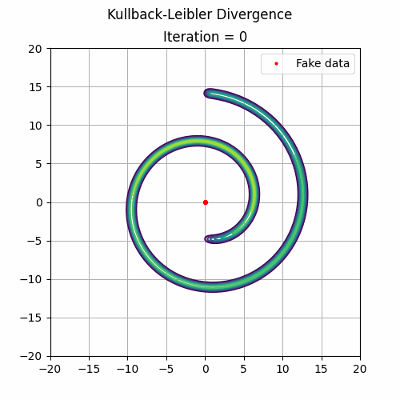
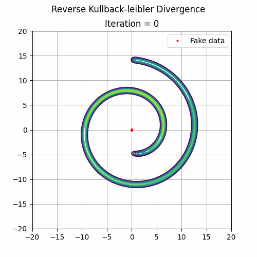
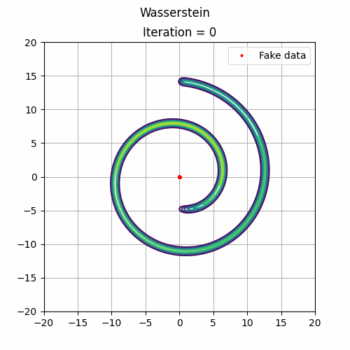

# Cumulant-GAN
Code for reproducing experiments in "Cumulant GAN".

Abstract- In this paper, we propose a novel loss function for training Generative Adversarial Networks (GANs) aiming towards deeper theoretical understanding as well as improved stability and performance for the underlying optimization problem. The new loss function is based on cumulant generating functions giving rise to Cumulant GAN. Relying on a recently-derived variational formula, we show that the corresponding optimization problem is equivalent to Rényi divergence minimization, thus offering a (partially) unified perspective of GAN losses: the Rényi family encompasses Kullback-Leibler divergence (KLD), reverse KLD, Hellinger distance and χ2-divergence. Wasserstein GAN is also a member of cumulant GAN. In terms of stability, we rigorously prove the linear convergence of cumulant GAN to the Nash equilibrium for a linear discriminator, Gaussian distributions and the standard gradient descent ascent algorithm. Finally, we experimentally demonstrate that image generation is more robust relative to Wasserstein GAN and it is substantially improved in terms of both inception score and Fréchet inception distance when both weaker and stronger discriminators are considered.

## Prerequisites
Python, NumPy, TensorFlow 2, SciPy, Matplotlib

## Models

* python cumgan_gmm8.py --epochs 10000 --disc_iters 5 --beta 0 --gamma 0 --iteration 0 --sess_name gmm8: Toy dataset (8 Gaussians).
* python cumgan_swissroll.py --epochs 10000 --disc_iters 5 --beta 0 --gamma 0 --iteration 0 --sess_name gmm8: Toy dataset (Swiss roll).
* python cumgan_tmm6.py --epochs 10000 --disc_iters 5 --beta 0 --gamma 0 --iteration 0 --sess_name gmm8: Toy dataset (6 t-Students)

## DATASETS

All the toy data exmaples are in data directory. For publicly avaiable CIFAR10 and ImageNET data, you may download and store it inside data directory. Otherwise, you can change the data paths inside .py files.

# GMM8 
### The target distribution is a mixture of 8 equiprobable and equidistant-from-the-origin Gaussian random variables.

(β, γ) = (0, 1)            |(β, γ) = (1, 0)            |(β, γ) = (0, 0)                   |(β, γ) = (0.5, 0.5)
:-------------------------:|:-------------------------:|:--------------------------------:|:-------------------------------:
 |||

# TMM
### The target distribution is a mixture of 6 equiprobable Student’s t distributions. The characteristic property of this distribution is that it is heavy-tailed. Thus samples can be observed far from the mean value.

 (β, γ) = (0, 1)           |  (β, γ) = (1, 0)             |   (β, γ) = (0, 0)                |  (β, γ) = (0.5, 0.5)
:-----------------------------:|:----------------------------:|:--------------------------------:|:--------------------------:
|| |

## Swiss roll
### The Swiss-roll dataset is a challenging example due to its complex manifold structure. Therefore the number of iterations required for training is increased by one order of magnitude.

 (β, γ) = (0, 1)           |  (β, γ) = (1, 0)             |   (β, γ) = (0, 0)                |  (β, γ) = (0.5, 0.5)
:-----------------------------:|:----------------------------:|:--------------------------------:|:--------------------------:
|| |

