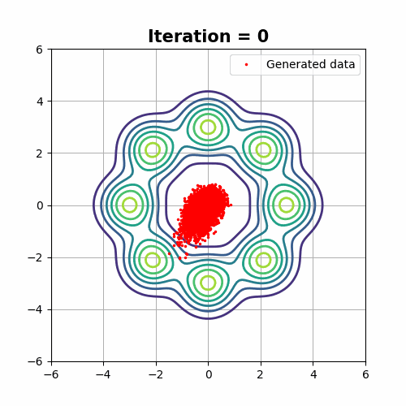

# Mode Covering versus Mode Selection
Demostration examples from [Cumulant GAN](https://arxiv.org/abs/2006.06625) paper.
* Code for all demonstrations can be found in [Dip's repo](https://github.com/dipjyoti92/CumulantGAN/tree/main/).
* TensorFlow 2 implementation.

## Prerequisites
Python, NumPy, TensorFlow 2, SciPy, Matplotlib

## How to run the models

* python cumgan_gmm8.py --epochs 10000 --disc_iters 5 --beta 0 --gamma 0 --iteration 0 --sess_name gmm8: Toy dataset (8 Gaussians).
* python cumgan_swissroll.py --epochs 10000 --disc_iters 5 --beta 0 --gamma 0 --iteration 0 --sess_name gmm8: Toy dataset (Swiss roll).
* python cumgan_tmm6.py --epochs 10000 --disc_iters 5 --beta 0 --gamma 0 --iteration 0 --sess_name gmm8: Toy dataset (6 t-Students)

## GMM8
### The target distribution is a mixture of 8 equiprobable and equidistant-from-the-origin Gaussian random variables.

|Wasserstein (β, γ) = (0, 0)    |Kullback-Leibler Divergence  (β, γ) = (0, 1)|(β, γ) = (1, 0)            |(β, γ) = (0.5, 0.5)
:-----------------------------------:|:-----------------------------------------------:|:-------------------------:|:-------------------------------:
|                    ||

## TMM6
### The target distribution is a mixture of 6 equiprobable Student’s t distributions. The characteristic property of this distribution is that it is heavy-tailed. Thus samples can be observed far from the mean value.

 (β, γ) = (0, 1)           |  (β, γ) = (1, 0)             |   (β, γ) = (0, 0)                |  (β, γ) = (0.5, 0.5)
:-----------------------------:|:----------------------------:|:--------------------------------:|:--------------------------:
|| |

## Swiss roll
### The Swiss-roll dataset is a challenging example due to its complex manifold structure. Therefore the number of iterations required for training is increased by one order of magnitude.

 (β, γ) = (0, 1)           |  (β, γ) = (1, 0)             |   (β, γ) = (0, 0)                |  (β, γ) = (0.5, 0.5)
:-----------------------------:|:----------------------------:|:--------------------------------:|:--------------------------:
|| |

# References
* Dipjyoti Paul, who implemented the experiments in TensorFlow 1
(["Dipyoti's website"](https://dipjyoti92.github.io/))

