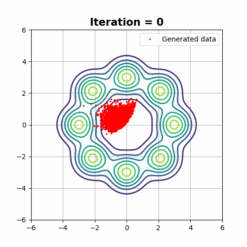

# Mode Covering versus Mode Selection
Demostration examples from [Cumulant GAN](https://arxiv.org/abs/2006.06625) paper.
* Code for all demonstrations can be found in [Dip's repo](https://github.com/dipjyoti92/CumulantGAN/tree/main/).
* TensorFlow 2 implementation.


## Prerequisites
Python, NumPy, TensorFlow 2, SciPy, Matplotlib


## Special cases of cumulant GAN


Line defined by β + γ = 1 has a point symmetry. The central point, (0.5,0.5)
corresponds to the Hellinger distance. For each point, (α, 1 − α), there is a symmetric one, i.e., (1 − α, α), which
has the same distance from the symmetry point. The respective divergences have reciprocal probability ratios (e.g.,
KLD & reverse KLD, χ^2-divergence & reverse χ^2-divergence, etc.). Each point on the ray starting at the origin and
pass through the point (α, 1 − α) also corresponds to (scaled) Rényi divergence of order α. These half-lines are called
d-rays.


KLD minimization that corresponds to (β, γ) = (0, 1) tends to cover all modes while reverse KLD that
corresponds to (β, γ) = (1, 0) tends to select a subset of them. This is particularly evident when the number
of iterations is between 500 and 2000. Hellinger distance minimization produces samples with statistics
that lie between KLD and reverse KLD minimization while Wasserstein distance minimization has a less
controlled behavior.

# Visualized Examples

## GMM8
### The target distribution is a mixture of 8 equiprobable and equidistant-from-the-origin Gaussian random variables.

|Wasserstein<br />(β, γ) = (0, 0)    |Kullback-Leibler Divergence <br />(β, γ) = (0, 1)|(β, γ) = (1, 0)            |(β, γ) = (0.5, 0.5)
:-----------------------------------:|:-----------------------------------------------:|:-------------------------:|:-------------------------------:
       |                    ||


## TMM6
### The target distribution is a mixture of 6 equiprobable Student’s t distributions. The characteristic property of this distribution is that it is heavy-tailed. Thus samples can be observed far from the mean value.

 (β, γ) = (0, 1)           |  (β, γ) = (1, 0)             |   (β, γ) = (0, 0)                |  (β, γ) = (0.5, 0.5)
:-----------------------------:|:----------------------------:|:--------------------------------:|:--------------------------:
|| |

## Swiss roll
### The Swiss-roll dataset is a challenging example due to its complex manifold structure. Therefore the number of iterations required for training is increased by one order of magnitude.


 (β, γ) = (0, 1)           |  (β, γ) = (1, 0)             |   (β, γ) = (0, 0)                |  (β, γ) = (0.5, 0.5)
:-----------------------------:|:----------------------------:|:--------------------------------:|:--------------------------:
|| |

# References
```
@inproceedings{Pantazis2022,
  author    = {"Yannis Pantazis, Dipjyoti Paul, Michail Fasoulakis, Yannis Stylianou and Markos Katsoulakis"},
  title     = {"Cumulant GAN"},
  journal   = {arXiv preprint arXiv:2006.06625},
  year      = {2022},
  publisher = {"IEEE Trans on Neural Networks & Learning Systems"}
}
```


