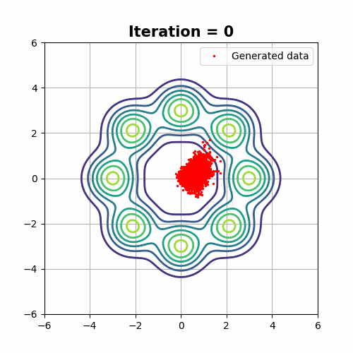
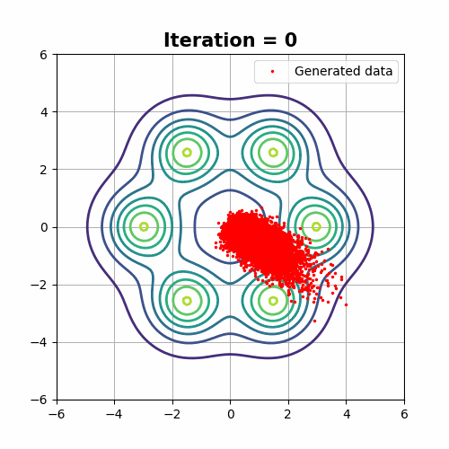
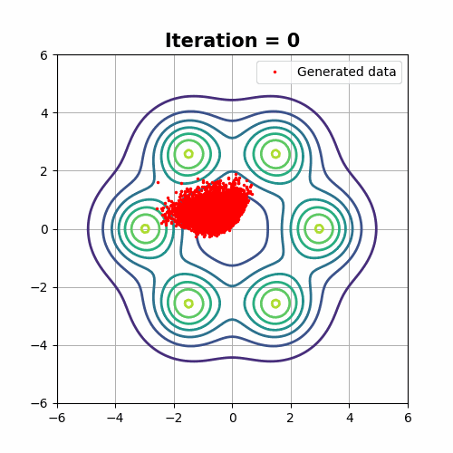
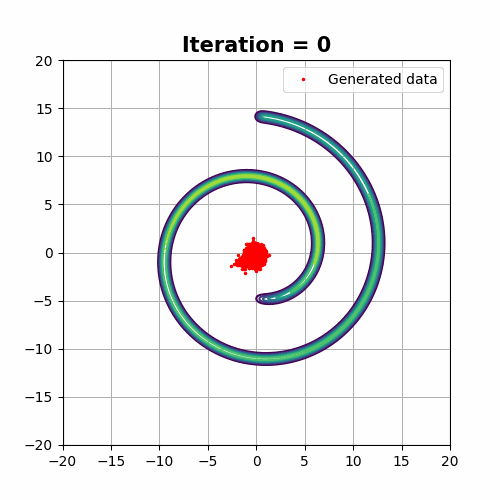

# Mode Covering versus Mode Selection

Demostration examples from [Cumulant GAN](https://arxiv.org/pdf/2011.08441.pdf) paper.
* Code for all demonstrations can be found in [Dip's repo](https://github.com/dipjyoti92/CumulantGAN/tree/main/).
* TensorFlow 2 implementation.


## Prerequisites
Python, NumPy, TensorFlow 2, SciPy, Matplotlib


## Special cases of cumulant GAN


Line defined by β + γ = 1 has a point symmetry. The central point, (0.5,0.5)
corresponds to the Hellinger distance. For each point, (α, 1 − α), there is a symmetric one, i.e., (1 − α, α), which
has the same distance from the symmetry point. The respective divergences have reciprocal probability ratios (e.g.,
KLD & reverse KLD, χ^2-divergence & reverse χ^2-divergence, etc.). Each point on the ray starting at the origin and
pass through the point (α, 1 − α) also corresponds to (scaled) Rényi divergence of order α. These half-lines are called
d-rays.


KLD minimization that corresponds to (β, γ) = (0, 1) tends to cover all modes while reverse KLD that
corresponds to (β, γ) = (1, 0) tends to select a subset of them. Hellinger distance minimization produces samples with statistics
that lie between KLD and reverse KLD minimization while Wasserstein distance minimization has a less
controlled behavior.

# Visualized Examples
## GMM8
### The target distribution is a mixture of 8 equiprobable and equidistant-from-the-origin Gaussian random variables.

|Wasserstein Distance <br />(β, γ) = (0, 0)    |Kullback-Leibler Divergence <br />(β, γ) = (0, 1)|Reverse Kullback-Leibler Divergence <br /> (β, γ) = (1, 0)|-4log(1-Hellinger^2) <br />(β, γ) = (0.5, 0.5)
:-----------------------------------:|:-----------------------------------------------:|:-------------------------:|:-------------------------------:
|||


## TMM6
### The target distribution is a mixture of 6 equiprobable Student’s t distributions. The characteristic property of this distribution is that it is heavy-tailed. Thus samples can be observed far from the mean value.

Wasserstein Distance<br />(β, γ) = (0, 0) |Kullback-Leibler Divergence <br />(β, γ) = (0, 1)|Reverse Kullback-Leibler Divergence <br /> (β, γ) = (1, 0)            |-4log(1-Hellinger^2) <br />(β, γ) = (0.5, 0.5)
:--------------------------------:|:-----------------------------------------------:|:--------------------------------:|:--------------------------:
|| |

## Swiss roll
### The Swiss-roll dataset is a challenging example due to its complex manifold structure. Therefore the number of iterations required for training is increased by one order of magnitude.


 Wasserstein Distance<br />(β, γ) = (0, 0)|Kullback-Leibler Divergence <br />(β, γ) = (0, 1) |Reverse Kullback-Leibler Divergence <br /> (β, γ) = (1, 0)|-4log(1-Hellinger^2) <br />(β, γ) = (0.5, 0.5)
:---------------------------------------------------:|:------------------------------------------------:|:--------------------------------:|:--------------------------:
 | ||


# Run Examples
To reproduce the achieved results run the [`main.py`](main.py) script with the corresponding arguments.
The output is a directory with some checkpoints during the traininng proccess, the corresponding plots and finally a gif that visualizes the whole training.

| Argument   | Default Value  | Info                                            |Choices
|:----------:|:--------------:| ----------------------------------------------- |:--------------------------:|
| `--epochs` | 10000          | [int] how many generator iterations to train for|-
| `--beta`   | 0.0            | [float] cumulant GAN beta parameter             |-
| `--gamma`  | 0.0            | [float] cumulant GAN gamma parameter            |-
| `--data`   | 'gmm8'         | [str] data target                               |'gmm8', 'tmm6', 'swissroll'


# References
```
@ARTICLE{9750393,
  author={Pantazis, Yannis and Paul, Dipjyoti and Fasoulakis, Michail and Stylianou, Yannis and Katsoulakis, Markos A.},
  journal={IEEE Transactions on Neural Networks and Learning Systems},
  title={Cumulant GAN},
  year={2022},
  pages={1-12},
  doi={10.1109/TNNLS.2022.3161127}}
```
